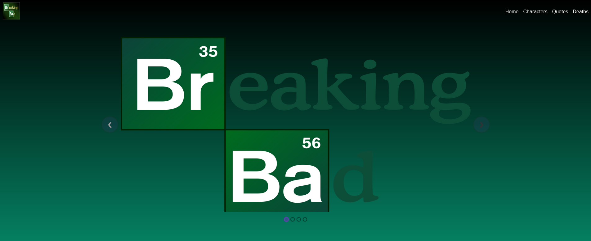
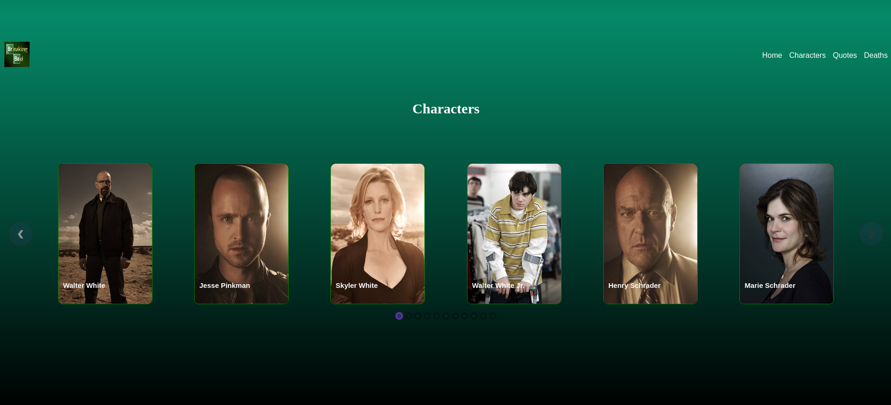
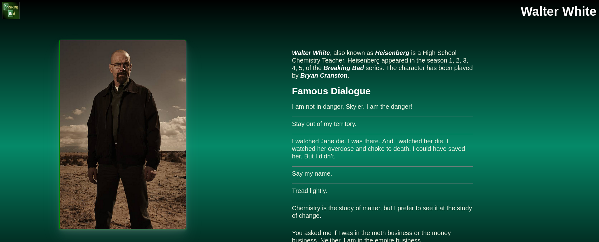

# Breaking Bad
This website is designed considering the curosity of the viewers to know about their popular show Breaking Bad. It consist of total 4 pages: Home, Character Information, Famous Dialogues, Deaths.
 
Deployed Link: https://breaking-bad-fans.netlify.app

## Major Components
### Navbar
Using the navigation bar user can easily navigate between pages. It consists of
- Logo: It is linked to the Home page. Hence, when clicked takes user back to the Home page.
- Home: When clicked it takes user to the beginning of the Home page.
- Characters: On clicking it the page will automatically scroll down to the characters section on the Home page.
- Quotes: On clicked user will be taken to the Quotes page.
- Deaths: When clicked it leads user to the Deaths page.

### Home
This screen showcase the famous banners of the series. The react-elastic-carousel package is used to enable banner sliding.

### Characters

This screen displays the characters appeared in the series. The characters data is fetched from the characters endpoint of the Breaking Bad API. This section also uses the react-elastic-carousel package for smooth sliding of the charcters cards. On clicking any of the Character card the user will be redirected to the Character Info page of that character.

### Character Info

This page display the all the innformation about the selected character. Along with the basic character information like nickname, actor name and seasons, it also displays the famous dialogues of that charcter in the series. You will also find if it has killed someone in the series or not. To do so, api calls are made to the quotes, and deaths endpoints.

User can come back to home page using the logo present on the navbar.

### Quotes
This page displays the famous dialogues of the series.

### Deaths
This page displays the information about the characters died in the series, along with the person responsible for that.

## Set up Code, and Run
- Download the zip file from the Github repository.
- Open it in any IDE.
- Dependencies to install
    - react-elastic-carousel (npm install --save react-elastic-carousel): For building sliding banners.
    - react-router-dom (npm i react-router-dom): For enabling navigation between pages.
    - react-scroll (npm install react-scroll): For on-page navigation among different sections.
- Save the files, and run "npm start" in the terminal.
- The website will load in the web browser at localhost:3000.

## Technology used
- create react app environment
- React, React-dom version 17.0.2 is used
- Breaking Bad API
- Netlify for Deployment 
- react-elastic-carousel package
- react-router-dom package
- react-scroll package